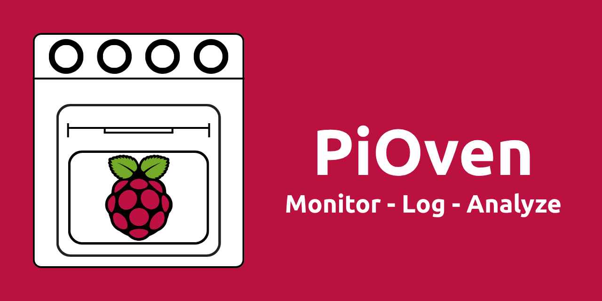

<p align="center">
    
</p>

## PiOven is a utility that allows you to actively monitor, log, and analyze CPU temperatures on any device running Raspberry Pi OS. It enables you to set-and-forget: Collect data for any length of time, then revisit that data when you are ready to see summarized results.

### Set Up
1. Clone the project repo:
    
    ```bash
    git clone <repo-url>
    ```
1. Change to the PiOven directory:
    ```bash
    cd PiOven
    ```
1. Make the `monitor_temp` script executable:
    ```bash
    chmod +x monitor_temp.sh
    ```
1. (Optional) Adjust the sampling interval in the `monitor_temp` script:
    - Open the file for editing:
        
        ```bash
        nano monitor_temp.sh
        ```
    - Change the sampling interval variable to the desired value, as an integer, in seconds:
        ```bash
        MONITOR_INTERVAL=<Desired Sample Interval>
        ```
    - Save the file with `ctrl+O`
    - Exit the editor with `ctrl+X`
1. Use make to show usage:
    ```bash
    make help
    ```

